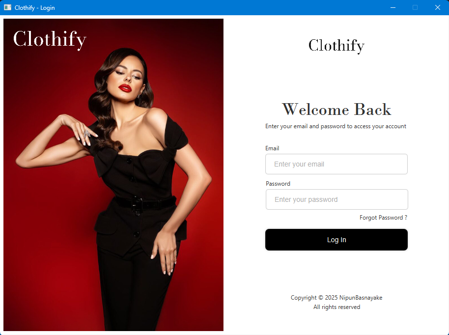
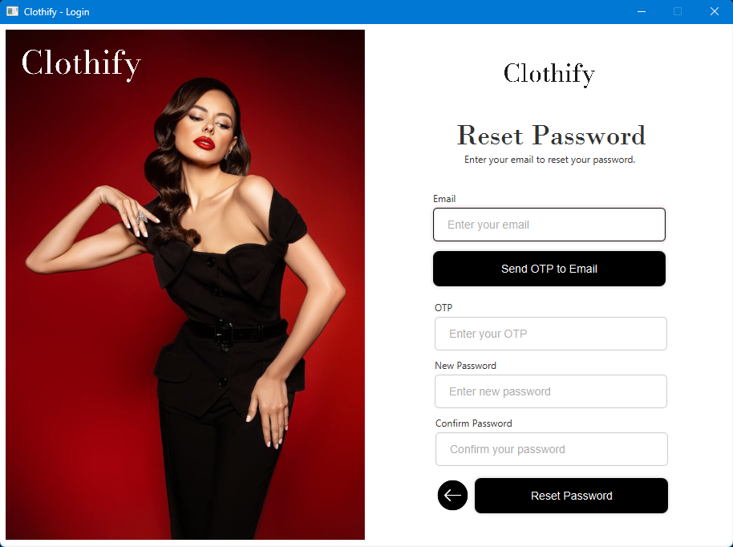
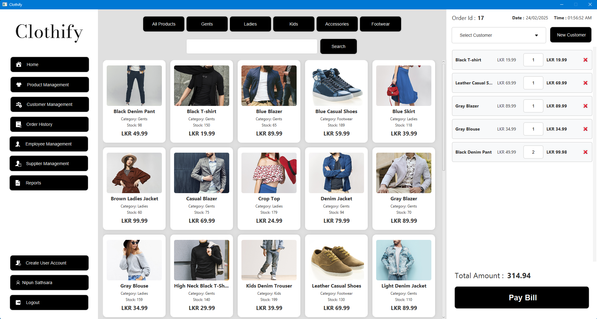
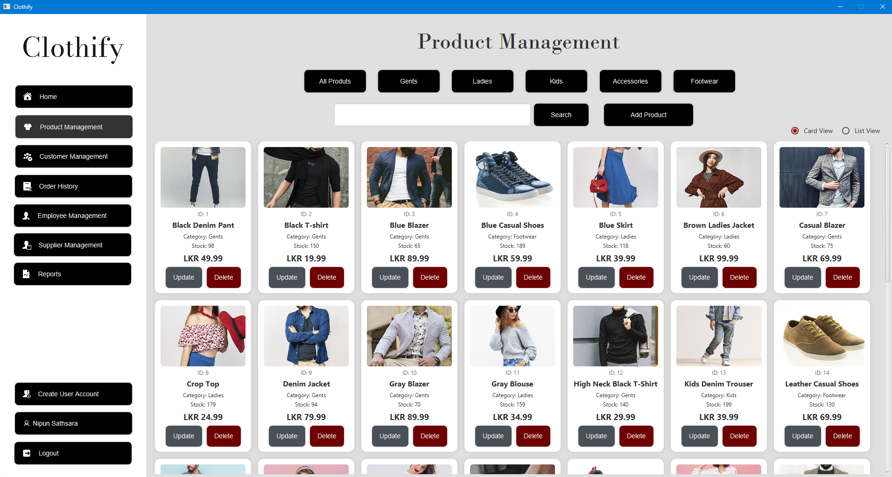
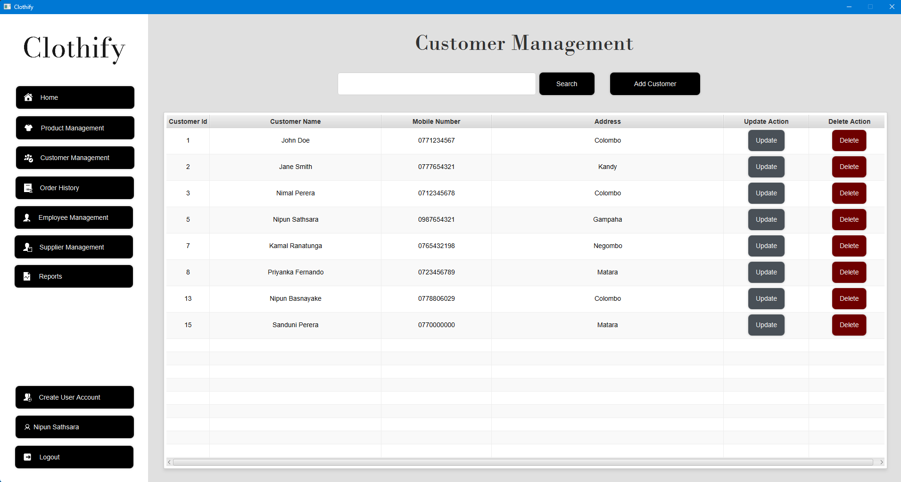
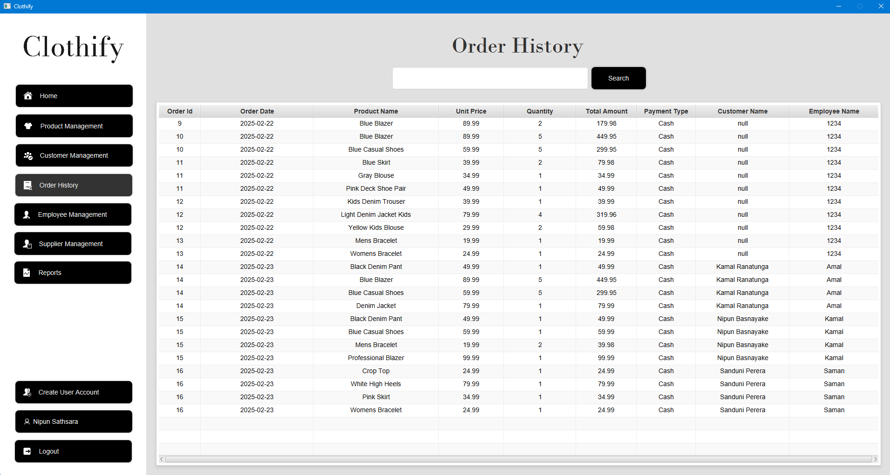
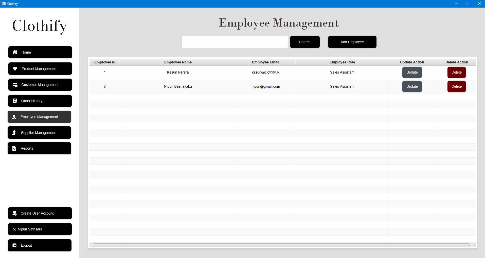
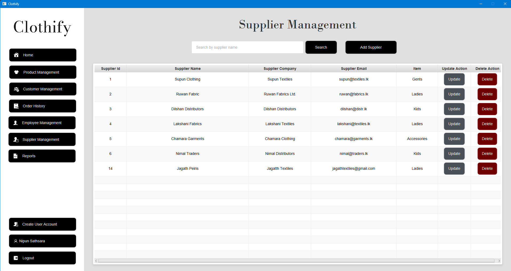
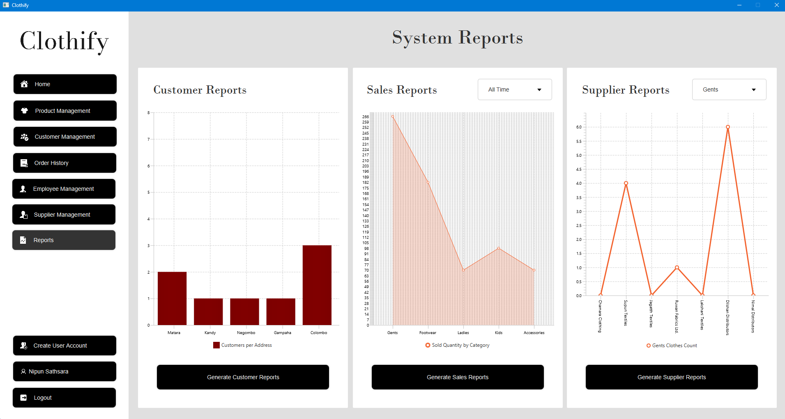

# **Clothify JavaFX Application**

## **Overview**
Clothify is a JavaFX-based point-of-sale (POS) system designed to optimize clothing store management. It simplifies daily operations by offering secure authentication, efficient checkout processes, inventory tracking, order management, and role-based access control. The application ensures seamless functionality with secure password encryption, OTP-based password resets, and robust database transactions.

---

## **Features**
- **User Authentication & Security**:
  - Secure user registration with encrypted passwords.
  - OTP-based password reset for enhanced security.
- **Product & Inventory Management**:
  - Add, update, delete, and view clothing items.
  - Stock tracking and inventory optimization.
- **Customer & Order History Tracking**:
  - Maintain detailed customer records.
  - View and manage past order history.
- **Supplier & Employee Management**:
  - Register and manage suppliers.
  - Assign roles and track employee activities.
- **Role-Based Access Control**:
  - Restrict system access based on user roles.
  - Admin permissions for enhanced security.
- **Comprehensive Reporting**:
  - Generate detailed analytics with JasperReports.
  
---

## **Technologies Used**
- **Programming Language**: Java  
- **Framework**: JavaFX for building the user interface  
- **Database**: MySQL for storing user, product, customer, and order data  
- **Database Connectivity**: Hibernate with JPA for database transactions  
- **Security**: Password encryption using Jasypt & OTP-based password reset via SunMail  
- **Dependency Injection**: Google Guice for scalable architecture  
- **Model Mapping**: ModelMapper for efficient data handling  
- **Animations**: AnimateFX for enhanced UI interactions  
- **Reporting**: JasperReports for generating detailed reports  
- **IDE**: IntelliJ IDEA for development  
- **Build Tool**: Maven for project management  

---

## **Project Status**
- **In Progress**: Actively being developed and optimized with additional features and security improvements.

---

## **Usage**

### **User Management**
1. **Register User**: Secure user registration with encrypted credentials.
2. **Login User**: Encrypted password authentication and OTP-based reset.

### **Product & Inventory Management**
1. **Add Product**: Register new clothing items with details such as name, price, and stock quantity.
2. **Update Product**: Modify product details, including prices and quantities.
3. **Delete Product**: Remove discontinued items from inventory.
4. **View Products**: Display a categorized list of available products.

### **Customer & Order History Management**
1. **Add Customer**: Register new customers with personal details.
2. **Update Customer**: Modify customer records as needed.
3. **Delete Customer**: Remove inactive customer records.
4. **View Customer Orders**: Track order history for each customer.

### **Order Management**
1. **Place Order**: Process orders with a fast and intuitive checkout system.
2. **View Orders**: Access order history with detailed item-wise breakdowns.
3. **Manage Orders**: Update or cancel orders if needed.

### **Supplier & Employee Management**
1. **Add Supplier**: Register and manage clothing suppliers.
2. **Manage Employees**: Assign roles and track employee activities.

### **Reporting & Analytics**
1. **Generate Reports**: Use JasperReports for sales and inventory analytics.
2. **Track Business Performance**: Access insights to improve store management.

---

## **Database Transactions**
- The application ensures data consistency through database transactions, preventing data corruption and maintaining integrity during order placements and inventory updates.

---

## **Screenshots**
  
  
  
  
  

---

## **Contributing**
Contributions are welcome! To contribute to Clothify, fork the repository, make your changes, and submit a pull request.

---

## **License**
This project is licensed under the MIT License. For more details, check the LICENSE file.

---

## **Credits**
- **Developer**: Nipun Basnayake  
- **Special Thanks**: Sharada Marasinha for valuable guidance and support.  
- **Libraries Used**:
  - JavaFX for UI development
  - Hibernate for database connectivity
  - MySQL Connector for data persistence
  - Google Guice for dependency injection
  - ModelMapper for data mapping
  - Jasypt for password encryption
  - SunMail for OTP-based authentication
  - JasperReports for generating reports
  - AnimateFX for UI animations

---

## **Contact**
For more details, questions, or contributions, feel free to contact:  
- Email: [nipunsathsara1999@gmail.com](mailto:nipunsathsara1999@gmail.com)  
- GitHub: [NipunBasnayake](https://github.com/NipunBasnayake)

